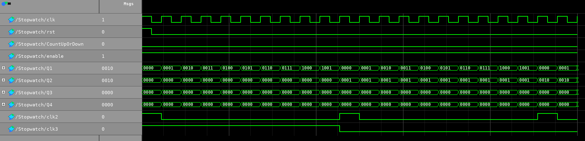
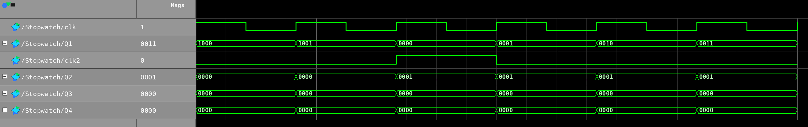
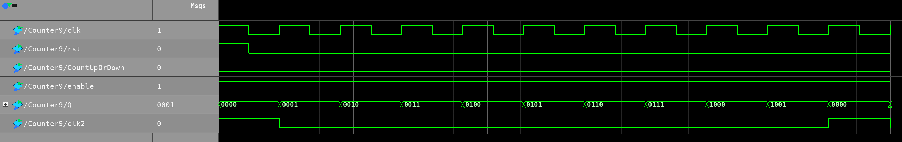
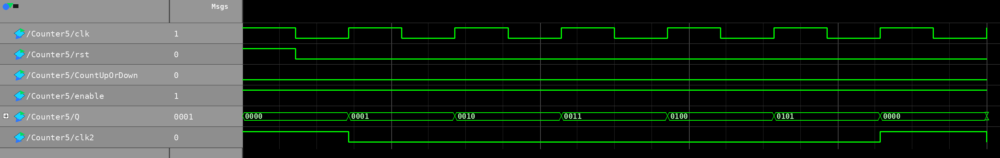
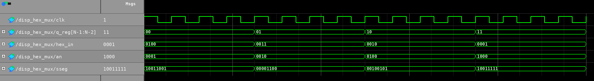
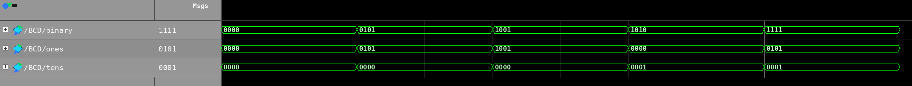

# FPGA Stopwatch System

FPGA Stopwatch System is a SystemVerilog digital-design project for a four-digit stopwatch implemented through an FPGA-oriented workflow. This design is a combination of cascaded digit counters, BCD style digit handling, seven segment display multiplexing, Quartus project configuration and ModelSim simulation scripts.

## Preview



The full stopwatch waveform shows the clock, reset, counting mode, four cascaded digit outputs, and rollover-related internal clock signals.



The cascade rollover view focuses on the moment where `Q1` rolls over and advances `Q2`, which is the key timing behavior of the stopwatch counter chain.



The Counter9 waveform follows the testbench behavior: reset starts high, then the counter increments through the 0-9 digit range and rolls over.



The Counter5 waveform verifies the 0-5 digit range used for the limited digit positions in the stopwatch.



The display multiplexer waveform shows the digit-select state, selected hex input, active `an` output, and seven-segment `sseg` pattern.



The BCD waveform follows the original BCD testbench input sequence and shows the corresponding ones/tens outputs.

## Main Features

* SystemVerilog implementation of an FPGA stopwatch
* Cascaded 0-9 and 0-5 digit counters
* Counter rollover propagation between digit positions
* Four-digit seven-segment display multiplexing
* ModelSim `.do` scripts for simulation

## Technical Overview

The integrated Quartus-facing source is:

```text
quartus_project/Stopwatch.sv
```

The modular source files are under:

```text
source_modules/
```

The stopwatch has four cascaded digit counters. `Counter9` is used for the first and third digits, `Counter5` is used for the second and fourth digits. The rollover behavior of each counter provides the timing event for the next digit, so the stopwatch display can roll over multiple digit positions.

Display logic uses `clkdiv` and `disp_hex_mux`. The clock divider slows the timing. The display multiplexer selects one of four digit values and maps the selected value to the `sseg` seven segment output pattern. The project also has `BinBCD` which converts a 4-bit binary value into ones and tens digits.

## How to Run / Review

1. Open the Quartus project:

```text
quartus_project/Stopwatch.qpf
```

2. Review the integrated top-level source:

```text
quartus_project/Stopwatch.sv
```

3. Review the modular implementation under:

```text
source_modules/Stopwatch/
source_modules/BCD/
```

4. Use the `.do` scripts under `modelsim_scripts/` to simulate the BCD module, counter modules, clock divider, and stopwatch module.

## Limitations

This is a simple implementation of a stopwatch, and it demonstrates the basic concepts of digital design like counters, rollover, BCD conversion and driving a seven segment display.
